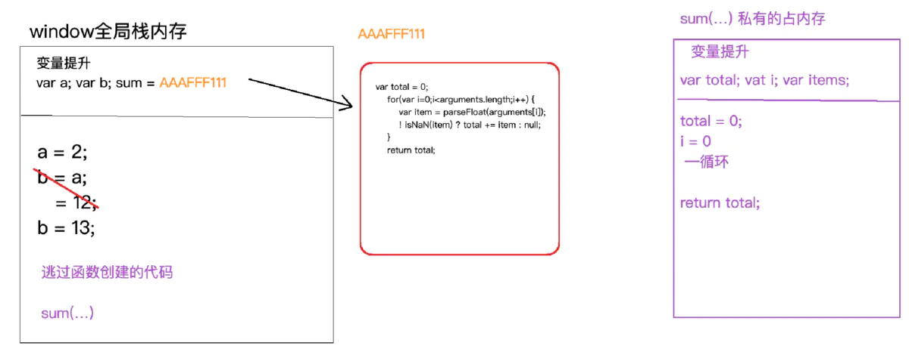
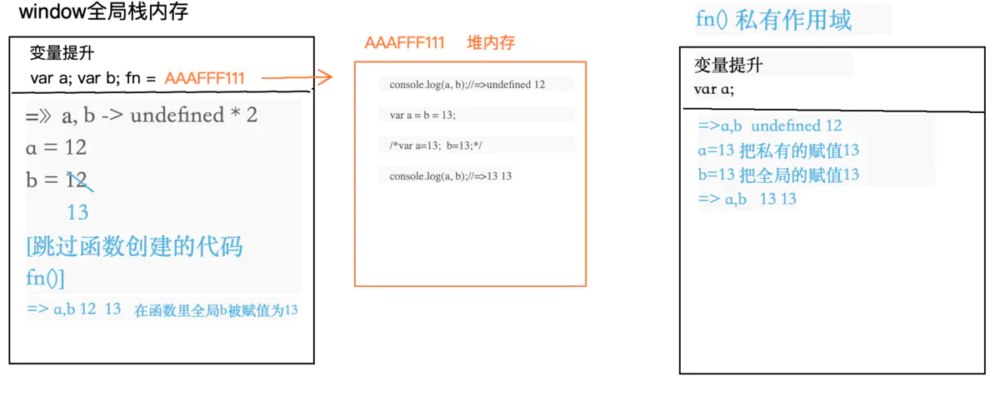

## 1. JS中的作用域
在 `js` 中有两种作用域
- 全局作用域
- 函数作用域

在es6之前，js中没有块级作用域。     
这里解释一下什么是块级作用域
```js
var i = 0;
if(true) {
    a = "我是linK哥";
}
console.log(a);
```
上面的代码，i的作用域是全局作用域，a是属于if的{}里面的，但是由于js中没有块级，所以这里的a的作用域仍然属于全局作用域。

## 2.什么是变量提升
先来看下面的代码：
```
console.log(a);
var a = 12;
```
从上面的代码中可以看出，先执行a，再定义a = 12,但是执行第一行console.log(a)的时候并没有报错，而是输出undefined，这说明在执行`console.log(a);`之前，浏览器中已经声明了a。

> 当栈内存（作用域），JS代码自上而下执行之前，浏览器首先会把“var.function"关键词的变量进行提升"声明"或者"定义"，这种预先处理机制称之为"变量提升"。          
> =>声明(declare)：var a  （默认值undefined）           
> =>定义(defined)：a=12 （定义其实就是赋值操作）

变量提升只发生在当前作用域（例如：开始加载页面的时候只对全局作用域下的进行提升，因为此时函数中存储的都是字符串而已）            
在全局作用域下声明的函数或者变量是“全局变量”，同理，在私有作用域下声明的变量是“私有变量” [带`var/function`的才是声明]

通过下面这段代码详细解读变量提升机制
```js
var a = 12;
/*
 * 1.先声明一个变量a，没有赋值（默认值是undefined）
 * 2.在当前作用域中开辟一个位置存储12这个值
 * 3.让变量a和12关联在一起（定义：赋值）
 */
var b = a;
b = 13;
console.log(a);

//编写一个函数实现任意数求和
function sum () {
    var total = 0;
    for(var i=0;i<arguments.length;i++) {
        var item = parseFloat(arguments[i]);  //因为argument存储的是字符串，需要转成数字
        // !isNaN(item) ? total += item : null;
        if( !isNaN(item)) {
            total += item;
        }
    }
    return total;
}
console.log(sum(10,12,15,41,10));
```


浏览器在加载页面的时候，首先开启一个`window`全局栈内存，会把`var/function`关键词的变量进行提升"声明"或者"定义"，从上面的代码中可以知道在变量提升阶段会声明变量a,b,还有sum，由于sum是属于函数对象，因此它的声明会把函数体以字符串的形式放在堆内存中，假设这块堆内存的地址是`AAAFFF111`，则`sum`就指向`AAAFFF111`这块堆内存空间，接着js代码进行自上而下执行，当执行到`function sum () `的时候会跳过函数创建的代码，因为在变量提升阶段函数已经声明了。最后执行`sum()`函数，这里会形成一个私有作用域，私有作用域形成后，也不是立即执行代码，一样先进行变量提升（变量提升钱，先进行形参赋值），然后再是js代码自上而下地执行。
> 注意：在ES3/ES5语法规范中，只有全局作用域和函数执行的私有作用域（栈内存），其中它大括号不会形成栈内存。

## 3. 带var 和不带 var的区别
在全局作用域下声明一个变量，也相当于给`window`全局对象设置了一个属性，全局变量和`window`属性存在“映射机制”，变量的值就是属性的值（私有作用域中声明的私有变量和`window`没啥关系）

### 3.1 带var
```js
console.log(a);  //undefined  由于变量替身的影响，所以输出的是undefined

console.log(window.a);  //undefined
// console.log('a' in window);    //true
// in 检测属性是否隶属于这个对象

var a = 12;
console.log(a);  //12  全局变量
console.log(window.a);  //12   window属性的a
```
带var是可以进行预解释的（变量提升）所以赋值前面执行是不会报错的。在变量提升阶段，在全局作用域中声明了一个变量a，此时已经把a当做一个属性赋值给window了，只是还没给它赋值a。          
下面通过var定义了全局变量`var a = 12;`,这时候window全局对象也设置了一个属性`a=12;`。所以打印输出的结果都是12。但是这时候如果在`var a = 12;`之前打印`window.a`，发现输出的是undefined，这说明这时候a并不是window中的属性，我们也可以通过`console.log('a' in window); `来判断。

### 3.2 不带var
```js
// console.log(a);  // error Uncaught ReferenceError: a is not defined

console.log(window.a);  //undefined
console.log('a' in window);  // false  说明a不是window中的属性

a = 12;   //这里并不是赋值，只是window.a = 12 的简写 (本质是window下的属性，不是变量)
console.log(a);  //12
console.log(window.a);  //12 
```
不带var的是不能进行预解释的（变量提升），在前面执行会报错(`ReferenceError`)。           
`a=12;`不带var并不是赋值，而是相当于给window添加了一个叫做a的属性，其属性值为12。在`a=12;`之前a是不属于window的属性的，可以通过`console.log('a' in window); `进行判断。

**特别注意**
```js
var a = 12,
    b = 13; //遮掩写b 是带var 的

var a = b = 12;  //这样写b是不带var的
// 相当于：
// var a = 12;
// b = 12;
```
### 3.3 私有作用域中的var
```js
console.log(a,b);  //undefined undefined
var a = 12,
    b = 12;

function fn() {
    console.log(a,b);  //undefined 12
    var a = b = 13;  
    //相当于： var a = 13;   b= 13;

    console.log(a,b);  //13 13
}
fn();
console.log(a,b); //12 13
```


**私有作用域中带var和不带var也有区别：**

- 带var在私有作用域变量提升阶段，都声明为私有变量，和外界没有任何关系
- 不带var不是私有变量，比如fn()里面的b，它会向它的上级作用域中查找，看是否为上级的变量，如果不是，就继续查找，一直到window位置（**这种查找机制叫做：“作用域链”**），也就是我们私有作用域操作的非私有变量，是可以直接操作外界的。

**但是，如果找到window都没有找不到呢？**
```js
function fn() {
    /**
     * 没有变量提升
     */
    //但是如果在这输出b 就会报错
    // console.log(b); //  ReferenceError: b is not defined
    b = 13;

    // 观察
    console.log('b' in window); //true
    //在作用域链查找的过程中，如果window也没有这个变量，相当于window设置了一个属性b  (window.b = 13)
    console.log(b); //13
}
fn();
console.log(b);  //13 所以这里输出是window.b 
```
通过上面代码可知，如果window也找不到，可以分为两种情况：
- 第一种情况：我们获取的值`console.log(b);  `报错了，ReferenceError。
- 第二种情况：相当于给window添加了一个属性b,其属性值为13；

### 3.4 总结
- 在全局作用域中：带var可以进行预解释，所以在赋值前面执行不会报错，不带var不进行预解释，在前面执行会报错(ReferenceError)。
- `a=12;`相当于给window添加一个叫做a的属性名，其属性值是12
`var a = 12;`相当给全局作用域添加一个全局变量a，但是不仅如此，它也相当于给window添加一个属性名。
- 私有作用域中出现的一个变量不是私有的，则往上级作用域进行查找，上级没有，则继续向上查找，一直找到window为止。如果window也没有，第一种是获取值的时候会报错，第二种是给window增加一个属性。

> 注意：在当前作用域下，不管条件是否成立都要进行变量提升        
> =>带VAR的还是只声明      
> =>带function的在老版本浏览器渲染机制下，声明和定义都处理，但是为了迎合ES6中的块级作用域，新版浏览器对于函数（在条件判断中的函数），不管条件是否成立，都只是先声明，没有定义，类似于VAR


